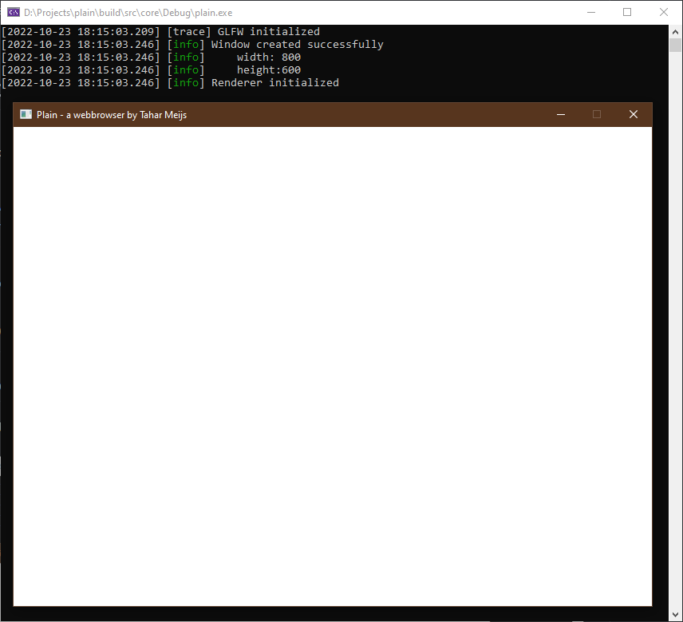
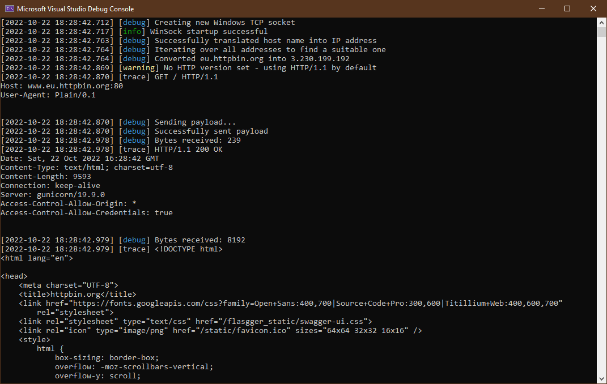

# Plain
Welcome to the Plain project!

Plain is an educational project to learn more about how webbrowsers work.
Everyone has used webbrowsers, yet only a small number of people *really* know how they work.

Multiple decades worth of research have gone into the likes of [Google Chrome](https://www.google.com/chrome/), [Mozilla FireFox](https://www.mozilla.org/en-US/firefox/), or [Microsoft Edge](https://www.microsoft.com/en-us/edge).
Plain will realistically never even come close to the commercial webbrowsers.

However, you will be able to navigate the web using Plain!

# Third-party libraries and SDKs
Writing a webbrowser from scratch is a lot of work.
To avoid spending a lot of time writing literally *everything* from scratch, Plain depends on a few third-party libraries and SDKs:
- [Vulkan](https://www.vulkan.org/): Next-generation API for 3D graphics and computing (could be seen as a "successor" to [OpenGL](https://www.opengl.org/)).
- [Spdlog](https://github.com/gabime/spdlog) ([MIT](https://github.com/gabime/spdlog/blob/v1.x/LICENSE)): Very fast, header-only/compiled, C++ logging library.
- [GLM](https://github.com/g-truc/glm) ([MIT](https://github.com/g-truc/glm/blob/master/copying.txt)): Header only C++ mathematics library.
- [GLFW](https://github.com/glfw/glfw) ([Zlib](https://github.com/glfw/glfw/blob/master/LICENSE.md)): A multi-platform library for OpenGL, OpenGL ES, Vulkan, window and input.

This project would not have been possible without the help of these awesome libraries. ♥

# Development log
## 1st of January 2023
- Added queue family discovery.

## 20th of December 2022
- Added physical device (GPU) selection.

## 11th of December 2022
- Added Vulkan instance creation.
- Added Vulkan extension and validation layer configuration.

## 23rd of October 2022
- Created graphics project.
- Added window creation.
  

## 22nd of October 2022
- Implemented very basic HTTP/1.1 protocol.
- Added logging to make it easier to debug the application.
- Managed to receive a valid response from a website.
  

## 8th of October 2022
- Created TCP socket abstraction layer for [WinSock](https://en.wikipedia.org/wiki/Winsock).

## 6th of October 2022
- Started working on Plain.
